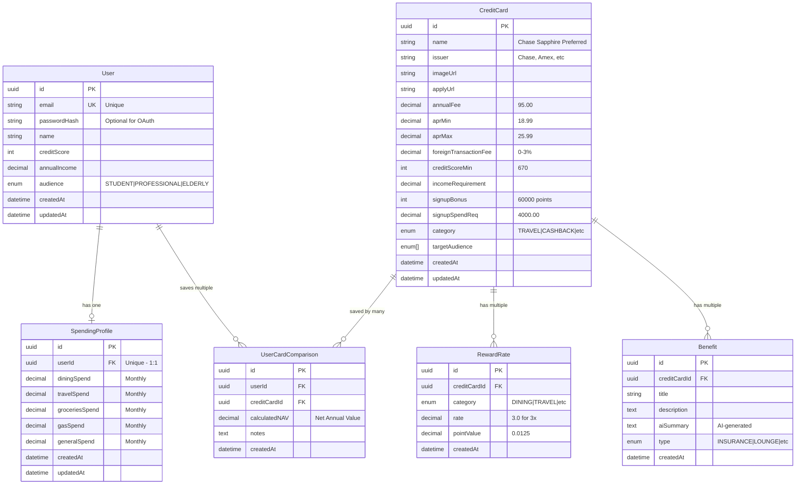

# CcardFinder - Entity Relationship Diagram

## Mermaid ERD



## Relationship Summary

### One-to-One (1:1)
- **User ↔ SpendingProfile**
  - Each user has exactly one spending profile
  - Cascade delete: Delete user → delete spending profile

### One-to-Many (1:N)
- **User → UserCardComparison**
  - User can save/compare multiple cards
  - Unique constraint: Can't save same card twice
  
- **CreditCard → RewardRate**
  - Card has multiple reward categories
  - Unique constraint: One rate per category per card
  - Example: Chase Sapphire - 2x DINING, 2x TRAVEL, 1x GENERAL

- **CreditCard → Benefit**
  - Card has multiple benefits
  - AI generates summaries for each

### Many-to-Many (N:M via Join Table)
- **User ↔ CreditCard** (through UserCardComparison)
  - Users can save multiple cards
  - Cards can be saved by multiple users
  - Join table stores calculated NAV and notes

## Indexes for Performance

### CreditCard
- `issuer` - Filter by Chase, Amex, etc.
- `category` - Filter by TRAVEL, CASHBACK
- `creditScoreMin` - Find cards for score 700+

### RewardRate
- `creditCardId` - Get all rates for a card
- `category` - Find all DINING rewards

### Benefit
- `creditCardId` - Get all benefits for a card
- `type` - Find all INSURANCE benefits

### UserCardComparison
- `userId` - Get user's saved cards

## Data Types

### Financial Precision
All money/decimal fields use `Decimal` type to prevent floating-point errors:
- `annualFee`: Decimal(10, 2) - Up to $99,999,999.99
- `apr`: Decimal(5, 2) - 0.00% to 999.99%
- `incomeRequirement`: Decimal(12, 2) - Up to $9,999,999,999.99
- `calculatedNAV`: Decimal(12, 2) - Can be negative

### Timestamps
- `createdAt`: Automatically set on creation
- `updatedAt`: Automatically updated on any change (via `@updatedAt`)

## Cascade Deletes

```
Delete User
  ↓ CASCADE
  ├─ SpendingProfile (deleted)
  └─ UserCardComparison (deleted)

Delete CreditCard
  ↓ CASCADE
  ├─ RewardRate (deleted)
  ├─ Benefit (deleted)
  └─ UserCardComparison (deleted)
```

## Example Queries

### Get Credit Cards for User's Profile
```typescript
const cards = await prisma.creditCard.findMany({
  where: {
    creditScoreMin: { lte: user.creditScore },
    targetAudience: { has: user.audience }
  },
  include: {
    rewardRates: true,
    benefits: true
  }
})
```

### Calculate NAV for User
```typescript
const profile = await prisma.spendingProfile.findUnique({
  where: { userId }
})

const nav = 
  (profile.diningSpend * diningRate.rate * diningRate.pointValue * 12) +
  (profile.travelSpend * travelRate.rate * travelRate.pointValue * 12) -
  card.annualFee
```

### Get User's Saved Cards with Comparison Data
```typescript
const savedCards = await prisma.userCardComparison.findMany({
  where: { userId },
  include: {
    creditCard: {
      include: {
        rewardRates: true,
        benefits: true
      }
    }
  },
  orderBy: { calculatedNAV: 'desc' }
})
```

